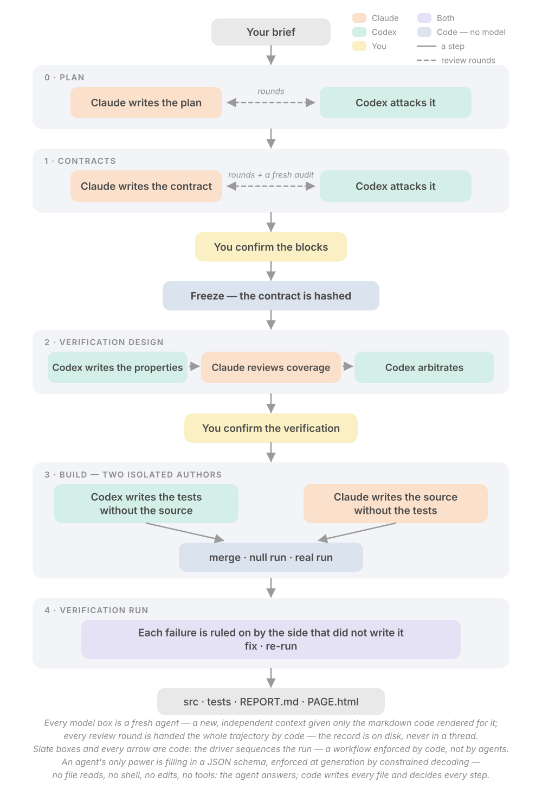

# code_steer_model_write

**Code steers, models write.** A template for agentic AI workflows — hackathons and real
projects — that is versatile, reliable and fast to start.

## The 14 universal rules

1. **Code controls the workflow end to end.** Sequencing, the next step, whether a step counts,
   every file write, every check run. Models only fill schemas.
2. **Agents read markdown rendered by code from JSON, and write only schema-constrained JSON.**
   No tools, files or shell unless the task needs them, and then only inside the folder the
   agent writes its output to (that folder is the sandbox root).
3. **No agent grades its own work.** The checker gets a frozen copy, and a different vendor
   where possible.
4. **One owner per fact, everything else derives.** The pydantic class owns the shape; JSON
   owns the content and markdown is a view; one gate record feeds every renderer.
5. **Every element has a code-assigned id, never renumbered.** Findings cite ids, so coverage
   is a set difference, not a judgment.
6. **Nothing is recorded from a refused answer.** Stage → check → atomic replace. A refusal is
   re-asked with the exact problems and the refused answer, bounded, stopping when the problem
   set repeats.
7. **The verification ladder.** Code checks first, an AI judge only where no field can answer,
   a human only for a value only they have or a judgment only they can make. Verdicts are
   graded severities, never booleans.
8. **Every loop is bounded by code and carries its full trajectory verbatim.** Convergence is
   computed, not asked. The unresolved is carried into the report, never hidden. The last
   revision always gets a closing read.
9. **No step is issued with nothing to do.** Zero findings → no arbitration; zero questions →
   no gate.
10. **One append-only event log, written as a side effect of the work.** Two signals side by
    side: did the process run, is the product right. Halts are reports, resume comes from disk,
    exit codes are honest (0 done, 1 record, 2 refusal).
11. **Human attention is the scarcest resource.** Batch questions, confirm by exception,
    pre-fill defaults, a mode dial whose auto-answers are flagged, never let waiting look like
    silence.
12. **Prove it offline first.** Fake models walk every branch with zero tokens before any live
    run. A check that never runs is not a check.
13. **Prompts are code-filled templates, not skills.** A missing key refuses before a token is
    spent. Tool denial is stated as fact in the prompt and enforced by the harness.
14. **Cost is a design axis.** No unused tools, thinking off where a check catches every
    mistake, calls batched, tokens as the honest measure.

## This is a template, not a project

Do not build a specific workflow inside this repository. It holds the runtime, the recipes and
the rules; a project is a **separate repo** scaffolded from it:

```bash
copier copy gh:<you>/code_steer_model_write ../my-workflow    # a new repo outside this one
cd ../my-workflow && csmw doctor
```

Your workflow's brief, task specs, prompts, fixtures and runs live there. Changes that belong
to everyone -- a new recipe, a fixed check, a better renderer -- come back here as a commit;
`copier update` carries them into every project.

## What it is

A Python package (`code_steer_model_write`, CLI `csmw`) plus recipes. A **recipe** declares a
workflow as data: stages, who authors and who checks each one, the pydantic schema every model
answer must fit, the code checks, the human gates, the evaluations. A coded driver runs it,
resumable from disk, with one append-only event log, a Prefect flow around it, MLflow traces
and evals beside it, and a Reflex dashboard on top. Four backends sit behind one `ask()`:
the Anthropic SDK, the Claude Agent SDK, LiteLLM, and the `claude` / `codex` CLIs — plus a
fake backend that walks the whole pipeline offline with zero tokens.

Recipes in the box: **code-builder** (plan → contract → freeze → tests by one model, source by
the other → null run → verify → triage), **debate / evaluation**, **research / analysis**,
**tool-using assistant**.

<p align="center"><picture>
<source media="(prefers-color-scheme: dark)" srcset="docs/media/workflow-dark.svg">

</picture></p>

## Install

```bash
python3 -m venv .venv && .venv/bin/pip install -e ".[dev]"
cp .env.example .env          # one API key is enough to start; FAKE_MODELS=1 needs none
just doctor                   # exit 0 = ready; every line it checked is printed (or: .venv/bin/csmw doctor)
```

## First run

```bash
just walk code_builder        # the whole recipe on fake models: 10 legs, zero tokens, ~20 s
just dash                     # the dashboard on 127.0.0.1:3000
just run examples/code_builder/task.json
```

`docs/QUICKSTART.md` lists every command; `docs/HACKATHON-30MIN.md` is the first half hour.

## Settings you choose once

The run's start page is one form: the brief, then one card per setting — the running mode,
the rounds cap, the checker's model, effort and speed, then a model and an effort per stage
for the author side, then the verification-run overrides — each a row of chips with the default
pre-selected and a one-line reason for that default. The pre-selected setup is a one-round
average task: the checker at high effort (a lazy review looks identical to a clean pass), the
contract and verification rows carrying the judgment, the build on the cheapest model. Adjust
per task; your picks are remembered for the next run. The form derives from one settings
schema, which the CLI reads too. The layout is `docs/DASHBOARD-DESIGN.md` → *The start page*.

## Read more

- [docs/PLAN.md](docs/PLAN.md) — the full design: backbone, schemas, verification, recipes, dashboard, figure, build order
- [docs/RELIABILITY.md](docs/RELIABILITY.md) — the doctrine the rules come from (imported from freeze-and-swap)
- [docs/BUG-LEDGER.md](docs/BUG-LEDGER.md) — the bug classes; classify before fixing, fix the class
- [docs/HACKATHON-30MIN.md](docs/HACKATHON-30MIN.md) — the first thirty minutes
- [docs/ADD-A-RECIPE.md](docs/ADD-A-RECIPE.md) — extend it

## Prior art

Descends from [freeze-and-swap](https://github.com/msoliman6/freeze-and-swap) (MIT): the
freeze, the swap, the coded driver, the offline walk, the page. This template generalises its
doctrine into recipes on a Prefect + MLflow + Reflex runtime.

## License

MIT.
